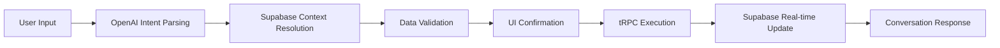

# Integration Workflows: Conversational AI ↔ Supabase Coordination

## Core Integration Pattern

### Conversational Intent → Database Action Flow


## Expense Creation Workflow

### Complete Flow Example
```typescript
// 1. User Input: "I paid $50 for dinner with John and Jane"
const conversationalExpenseCreation = async (userInput: string, context: ConversationContext) => {
  
  // 2. OpenAI Intent Parsing
  const intent = await parseExpenseIntent(userInput, context)
  // Result: { amount: 50, description: "dinner", participants: ["John", "Jane"] }
  
  // 3. Supabase Context Resolution
  const resolvedParticipants = await resolveParticipants(intent.participants, context.groupId)
  // Query: group_members joined with users where name matches
  
  // 4. Data Validation & Confirmation
  const confirmedData = await presentConfirmation({
    ...intent,
    participants: resolvedParticipants,
    paidBy: context.userId
  })
  
  // 5. tRPC Execution (using existing business logic)
  const expense = await trpc.expenses.create.mutate(confirmedData)
  
  // 6. Real-time Updates via Supabase
  // Automatic via Supabase subscriptions to other group members
  
  // 7. Conversational Response
  return {
    type: 'expense_created',
    message: `Great! I've added the $50 dinner expense split with John and Jane.`,
    expense: expense
  }
}
```

### Participant Resolution Logic
```typescript
const resolveParticipants = async (names: string[], groupId: string) => {
  const results = await Promise.all(
    names.map(async (name) => {
      const { data } = await supabase
        .from('group_members')
        .select(`
          user_id,
          users!inner(id, name, email)
        `)
        .eq('group_id', groupId)
        .ilike('users.name', `%${name}%`)
      
      if (data.length === 0) {
        return { error: `No user found matching "${name}"`, suggestions: [] }
      }
      if (data.length > 1) {
        return { 
          error: `Multiple users found for "${name}"`,
          suggestions: data.map(u => ({ id: u.users.id, name: u.users.name }))
        }
      }
      return { user: data[0].users }
    })
  )
  
  return results
}
```

## Balance Query Workflow

### "How much does John owe me?" Flow
```typescript
const conversationalBalanceQuery = async (userInput: string, context: ConversationContext) => {
  
  // 1. Parse balance intent
  const intent = await parseBalanceIntent(userInput, context)
  // Result: { type: 'user_specific', targetUser: 'John', queryType: 'owes_me' }
  
  // 2. Resolve target user
  const targetUser = await resolveParticipants([intent.targetUser], context.groupId)
  
  if (targetUser[0].error) {
    return {
      type: 'clarification_needed',
      message: targetUser[0].error,
      suggestions: targetUser[0].suggestions
    }
  }
  
  // 3. Execute balance calculation via tRPC
  const balanceData = await trpc.balances.list.query({
    groupId: context.groupId,
    userId: context.userId,
    targetUserId: targetUser[0].user.id
  })
  
  // 4. Format conversational response
  const amount = balanceData.find(b => 
    b.fromUserId === targetUser[0].user.id && b.toUserId === context.userId
  )?.amount || 0
  
  return {
    type: 'balance_response',
    message: amount > 0 
      ? `John owes you $${amount.toFixed(2)}`
      : amount < 0 
        ? `You owe John $${Math.abs(amount).toFixed(2)}`
        : `You and John are even!`,
    data: balanceData
  }
}
```

## Group Management Workflow

### "Create a Vegas trip group" Flow
```typescript
const conversationalGroupCreation = async (userInput: string, context: ConversationContext) => {
  
  // 1. Parse group creation intent
  const intent = await parseGroupIntent(userInput, context)
  // Result: { name: "Vegas trip", initialMembers: [], currency: "USD" }
  
  // 2. Validate group name uniqueness
  const { data: existingGroups } = await supabase
    .from('groups')
    .select('name')
    .eq('created_by', context.userId)
    .ilike('name', intent.name)
  
  if (existingGroups.length > 0) {
    return {
      type: 'clarification_needed',
      message: `You already have a group named "${intent.name}". Use a different name?`
    }
  }
  
  // 3. Present confirmation with existing group creation UI
  const confirmedData = await presentGroupConfirmation(intent)
  
  // 4. Create group via tRPC
  const group = await trpc.groups.create.mutate(confirmedData)
  
  // 5. Auto-subscribe to group real-time updates
  const subscription = supabase
    .channel(`group:${group.id}`)
    .on('postgres_changes', { event: '*', schema: 'public', table: 'group_members' }, 
      (payload) => updateConversationContext(payload))
    .subscribe()
  
  return {
    type: 'group_created',
    message: `Perfect! I've created the "${intent.name}" group. You can now add expenses and invite members.`,
    group: group,
    subscription: subscription
  }
}
```

## Real-time Coordination Patterns

### Live Conversation Updates
```typescript
const setupConversationSubscriptions = (context: ConversationContext) => {
  const subscriptions = []
  
  // Expense changes in current group
  if (context.currentGroupId) {
    const expenseSubscription = supabase
      .channel(`expenses:${context.currentGroupId}`)
      .on('postgres_changes',
        { 
          event: '*', 
          schema: 'public', 
          table: 'expenses',
          filter: `group_id=eq.${context.currentGroupId}`
        },
        (payload) => {
          // Update conversation context with new expense
          updateConversationWithRealTimeChange({
            type: 'expense_change',
            payload: payload,
            message: generateRealTimeMessage(payload)
          })
        }
      )
      .subscribe()
    
    subscriptions.push(expenseSubscription)
  }
  
  return subscriptions
}

const generateRealTimeMessage = (payload: any) => {
  switch (payload.eventType) {
    case 'INSERT':
      return `New expense added: ${payload.new.description} ($${payload.new.amount})`
    case 'UPDATE':
      return `Expense updated: ${payload.new.description}`
    case 'DELETE':
      return `Expense deleted: ${payload.old.description}`
  }
}
```

## Error Handling Coordination

### Database Error → Conversational Response
```typescript
const handleDatabaseErrors = (error: any, context: ConversationContext) => {
  const conversationalErrors = {
    'permission_denied': "You don't have permission to perform that action in this group.",
    'foreign_key_violation': "One of the referenced users or groups doesn't exist.",
    'check_constraint': "The data doesn't meet the requirements. Please check amounts and dates.",
    'unique_violation': "That name is already taken. Please choose a different one."
  }
  
  return {
    type: 'error_response',
    message: conversationalErrors[error.code] || "Something went wrong. Please try again.",
    suggestedAction: generateErrorRecoveryAction(error, context)
  }
}
```

## Performance Coordination

### Optimized Query Patterns for Conversations
```typescript
// Batch participant resolution for multiple names
const batchResolveParticipants = async (names: string[], groupId: string) => {
  const { data } = await supabase
    .from('group_members')
    .select(`
      user_id,
      users!inner(id, name, email)
    `)
    .eq('group_id', groupId)
    .in('users.name', names) // Single query for all names
  
  return names.map(name => 
    data.filter(row => 
      row.users.name.toLowerCase().includes(name.toLowerCase())
    )
  )
}

// Cache group context for conversation session
const cacheGroupContext = async (groupId: string) => {
  const [members, recentExpenses, groupDetails] = await Promise.all([
    supabase.from('group_members').select('*, users(*)').eq('group_id', groupId),
    supabase.from('expenses').select('*').eq('group_id', groupId).limit(10),
    supabase.from('groups').select('*').eq('id', groupId).single()
  ])
  
  return { members: members.data, recentExpenses: recentExpenses.data, group: groupDetails.data }
}
```

## Testing Integration Workflows

### Mock Conversation Flow Testing
```typescript
const testConversationFlow = async () => {
  // 1. Mock user input
  const input = "I paid $50 for dinner with John"
  
  // 2. Mock context
  const context = {
    userId: 'user1',
    currentGroupId: 'group1',
    groupMembers: [{ id: 'user2', name: 'John' }]
  }
  
  // 3. Test complete workflow
  const result = await conversationalExpenseCreation(input, context)
  
  // 4. Verify database state
  const { data: expense } = await supabase
    .from('expenses')
    .select('*')
    .eq('description', 'dinner')
    .single()
  
  expect(expense.amount).toBe(50)
  expect(result.type).toBe('expense_created')
}
``` 