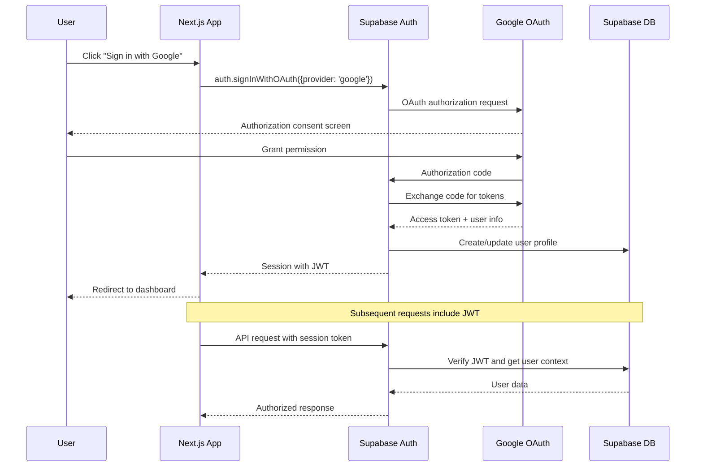

# Backend Architecture

## Service Architecture

### Function Organization (Serverless with Supabase Edge Functions)
```
supabase/functions/
├── conversation-processor/   # Main conversation logic
│   ├── index.ts
│   ├── jules-agent.ts
│   ├── intent-parser.ts
│   └── entity-enricher.ts
├── ai-gateway/              # AI service abstraction
│   ├── index.ts
│   ├── openai-client.ts
│   └── fallback-parser.ts
├── context-manager/         # Conversation state management
│   ├── index.ts
│   ├── context-crud.ts
│   └── cleanup-scheduler.ts
└── shared/                  # Shared utilities
    ├── types.ts
    ├── validation.ts
    └── supabase-client.ts
```

### Edge Function Template
```typescript
// Supabase Edge Function for conversation processing
import { serve } from 'https://deno.land/std@0.168.0/http/server.ts';
import { createClient } from 'https://esm.sh/@supabase/supabase-js@2';
import { JulesAgent } from './jules-agent.ts';

serve(async (req) => {
  try {
    // CORS handling
    if (req.method === 'OPTIONS') {
      return new Response('ok', { 
        headers: {
          'Access-Control-Allow-Origin': '*',
          'Access-Control-Allow-Methods': 'POST',
          'Access-Control-Allow-Headers': 'authorization, x-client-info, apikey, content-type',
        }
      });
    }
    
    // Authentication
    const authHeader = req.headers.get('Authorization');
    if (!authHeader) {
      return new Response('Unauthorized', { status: 401 });
    }
    
    // Initialize services
    const supabase = createClient(
      Deno.env.get('SUPABASE_URL') ?? '',
      Deno.env.get('SUPABASE_SERVICE_ROLE_KEY') ?? ''
    );
    
    const { data: { user } } = await supabase.auth.getUser(
      authHeader.replace('Bearer ', '')
    );
    
    if (!user) {
      return new Response('Unauthorized', { status: 401 });
    }
    
    // Process conversation
    const { message, group_id } = await req.json();
    const jules = new JulesAgent(supabase);
    
    const result = await jules.processUserMessage(message, user.id, group_id);
    
    return new Response(JSON.stringify(result), {
      headers: { 
        'Content-Type': 'application/json',
        'Access-Control-Allow-Origin': '*'
      },
    });
    
  } catch (error) {
    return new Response(JSON.stringify({ error: error.message }), {
      status: 500,
      headers: { 
        'Content-Type': 'application/json',
        'Access-Control-Allow-Origin': '*'
      },
    });
  }
});
```

## Database Architecture

### Data Access Layer
```typescript
// Repository pattern for conversation data
export class ConversationRepository {
  constructor(private supabase: SupabaseClient) {}
  
  async createContext(context: Omit<ConversationContext, 'id' | 'created_at' | 'updated_at'>) {
    const { data, error } = await this.supabase
      .from('conversation_contexts')
      .insert(context)
      .select()
      .single();
      
    if (error) throw error;
    return data;
  }
  
  async updateContext(id: string, updates: Partial<ConversationContext>) {
    const { data, error } = await this.supabase
      .from('conversation_contexts')
      .update({ ...updates, updated_at: new Date() })
      .eq('id', id)
      .select()
      .single();
      
    if (error) throw error;
    return data;
  }
  
  async addConversationTurn(turn: Omit<ConversationTurn, 'id' | 'timestamp'>) {
    const { data, error } = await this.supabase
      .from('conversation_turns')
      .insert(turn)
      .select()
      .single();
      
    if (error) throw error;
    return data;
  }
  
  async getActiveContext(userId: string, groupId?: string) {
    const query = this.supabase
      .from('conversation_contexts')
      .select('*')
      .eq('user_id', userId)
      .gt('expires_at', new Date().toISOString())
      .order('updated_at', { ascending: false })
      .limit(1);
      
    if (groupId) {
      query.eq('group_id', groupId);
    } else {
      query.is('group_id', null);
    }
    
    const { data, error } = await query.single();
    if (error && error.code !== 'PGRST116') throw error; // PGRST116 = not found
    return data;
  }
  
  async cleanupExpiredContexts() {
    const { error } = await this.supabase
      .from('conversation_contexts')
      .delete()
      .lt('expires_at', new Date().toISOString());
      
    if (error) throw error;
  }
}
```

## Authentication and Authorization

### Auth Flow


### Auth Middleware
```typescript
// Next.js middleware for auth and conversation context
import { createMiddlewareClient } from '@supabase/auth-helpers-nextjs';
import type { NextRequest } from 'next/server';

export async function middleware(request: NextRequest) {
  const res = NextResponse.next();
  const supabase = createMiddlewareClient({ req: request, res });
  
  // Refresh session if exists
  const { data: { session } } = await supabase.auth.getSession();
  
  // Auth protection
  const protectedPaths = ['/groups', '/profile', '/conversations'];
  const isProtectedPath = protectedPaths.some(path => 
    request.nextUrl.pathname.startsWith(path)
  );
  
  if (isProtectedPath && !session) {
    return NextResponse.redirect(new URL('/auth/signin', request.url));
  }
  
  // Add user context to headers for conversation processing
  if (session) {
    res.headers.set('x-user-id', session.user.id);
    res.headers.set('x-user-email', session.user.email || '');
  }
  
  return res;
}

export const config = {
  matcher: ['/((?!api|_next/static|_next/image|favicon.ico).*)'],
};
```
