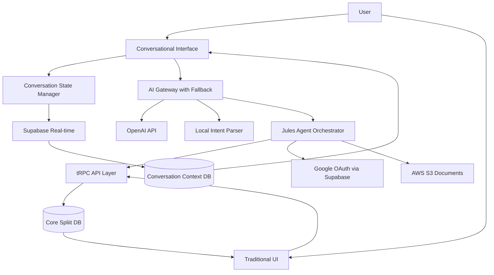

# High Level Architecture

## Technical Summary

The Conversational Spliit architecture implements a **hybrid conversational-first approach** with Supabase-powered real-time capabilities. The system maintains the existing Next.js 14/tRPC foundation while adding a conversational AI layer that transforms user intent into visual confirmations using existing UI components. Supabase replaces PostgreSQL to enable real-time conversation updates, collaborative features, and streamlined authentication with Google OAuth. The architecture follows a **conversation → parse → confirm → execute** pattern, where AI interprets natural language, populates familiar forms for user confirmation, then executes through existing business logic. This approach preserves data integrity and user confidence while achieving the UX→AX transformation goal.

## Platform and Infrastructure Choice

**Current Hosting Setup**: What platform are you currently using to host Spliit? (e.g., Vercel, Netlify, AWS, Google Cloud, self-hosted, etc.)

Based on conversational AI requirements and optimal Supabase integration, here are the platform recommendations:

**Optimal: Vercel + Supabase**
- ✅ **Real-time Excellence**: Native WebSocket support for instant conversation updates
- ✅ **Edge Functions Integration**: Supabase Edge Functions co-located with Vercel edge network
- ✅ **OpenAI Proximity**: Both Vercel and Supabase have optimized OpenAI API connections
- ✅ **Google OAuth Seamless**: Supabase Auth's best-in-class social provider integration
- ✅ **Conversational Performance**: Sub-100ms latency for AI response streaming
- ✅ **Jules Implementation**: Vercel's serverless functions ideal for AI agent orchestration

**Strong Alternative: Railway + Supabase**
- ✅ **Developer Experience**: Excellent for Next.js apps with real-time features
- ✅ **Cost Efficiency**: More predictable pricing than serverless for high AI usage
- ✅ **Full Control**: Better for custom Jules agent implementations
- ⚠️ **Edge Distribution**: Less global presence than Vercel

**Enterprise Option: AWS + Supabase**
- ✅ **Scale & Control**: Unlimited customization for complex AI workflows
- ✅ **Security Compliance**: Enterprise-grade security for sensitive financial data
- ✅ **AI Ecosystem**: Strong integration with AWS AI/ML services
- ⚠️ **Complexity**: Higher operational overhead
- ⚠️ **Real-time Setup**: Requires additional WebSocket infrastructure setup

**Not Recommended: Google Cloud + Firebase**
- ⚠️ **Supabase Conflict**: Firebase and Supabase serve similar purposes, creates redundancy
- ⚠️ **tRPC Compatibility**: Firebase functions less optimal for existing tRPC patterns

**Platform:** [Pending your current setup confirmation]
**Key Services:** [To be determined based on your hosting preference]
**Deployment Host and Regions:** [To be specified after platform selection]

## Repository Structure

**Structure:** Monorepo with enhanced organization for conversational features
**Monorepo Tool:** npm workspaces (consistent with existing Next.js setup)
**Package Organization:** Feature-based with shared conversational components

## Architectural Patterns

- **Jamstack with Real-time Enhancement:** Static generation with Supabase real-time subscriptions - _Rationale:_ Combines performance benefits with live conversational capabilities
- **Confirmation-First Conversational Pattern:** AI intent → visual confirmation → execution - _Rationale:_ Maintains user trust while enabling natural language interaction
- **Component Reuse Architecture:** Existing forms serve as confirmation interfaces - _Rationale:_ Minimizes development effort and maintains UI consistency
- **Event-Driven Conversational State:** Supabase real-time for conversation updates - _Rationale:_ Enables collaborative features and live conversation synchronization
- **Progressive Enhancement with AI:** Traditional UI remains fully functional - _Rationale:_ Zero disruption to existing users while encouraging conversational adoption
- **Hybrid API Strategy:** tRPC for complex business logic + Supabase client for real-time - _Rationale:_ Leverages existing investment while adding real-time capabilities 

## High Level Architecture Diagram



## Critical Risk Mitigation Patterns

### 1. Conversational Context State Management

**Technical Implementation:**

```typescript
// Supabase schema for conversation persistence
interface ConversationContext {
  id: string;
  user_id: string;
  group_id?: string;
  session_id: string; // Browser session identifier
  device_fingerprint: string; // For cross-device continuity
  conversation_state: {
    current_intent: string;
    parsed_entities: Record<string, any>;
    confirmation_pending: boolean;
    conversation_history: ConversationTurn[];
    context_variables: Record<string, any>;
  };
  expires_at: Date;
  created_at: Date;
  updated_at: Date;
}

interface ConversationTurn {
  id: string;
  type: 'user' | 'assistant' | 'system';
  content: string;
  metadata: {
    intent_confidence?: number;
    entities_extracted?: Record<string, any>;
    fallback_used?: boolean;
  };
  timestamp: Date;
}
```

**Cross-Device State Sync Pattern:**

```typescript
// Real-time conversation state synchronization
const useConversationState = () => {
  const [state, setState] = useState<ConversationContext>();
  
  useEffect(() => {
    // Subscribe to real-time updates across devices
    const channel = supabase
      .channel(`conversation:${userId}`)
      .on('postgres_changes', {
        event: 'UPDATE',
        schema: 'public',
        table: 'conversation_contexts',
        filter: `user_id=eq.${userId}`
      }, (payload) => {
        setState(payload.new as ConversationContext);
      })
      .subscribe();
      
    return () => supabase.removeChannel(channel);
  }, [userId]);
  
  const updateContext = async (updates: Partial<ConversationContext>) => {
    await supabase
      .from('conversation_contexts')
      .upsert({
        ...state,
        ...updates,
        expires_at: new Date(Date.now() + 24 * 60 * 60 * 1000) // 24h expiry
      });
  };
  
  return { state, updateContext };
};
```

### 2. OpenAI Fallback Strategy

**Technical Implementation:**

```typescript
// AI Gateway with graceful degradation
class AIGateway {
  async processConversationalInput(input: string, context: ConversationContext) {
    try {
      // Primary: OpenAI processing
      return await this.processWithOpenAI(input, context);
    } catch (error) {
      if (this.isOpenAIUnavailable(error)) {
        // Fallback 1: Local intent parsing
        const fallbackResult = await this.processWithLocalParser(input, context);
        if (fallbackResult.confidence > 0.7) {
          return { ...fallbackResult, fallback_used: 'local_parser' };
        }
        
        // Fallback 2: Direct UI transition
        return this.createUITransition(input, context);
      }
      throw error;
    }
  }
  
  private async processWithLocalParser(input: string, context: ConversationContext) {
    // Simple keyword-based intent detection for common patterns
    const patterns = {
      create_expense: /(?:i (?:paid|spent)|add expense|new expense).*?(\$?[\d,]+\.?\d*)/i,
      view_balances: /(?:who owes|balance|how much.*owe)/i,
      create_group: /(?:create|new|make).*?group.*?(?:for|called|named)\s+([^.!?]+)/i
    };
    
    for (const [intent, pattern] of Object.entries(patterns)) {
      const match = input.match(pattern);
      if (match) {
        return {
          intent,
          entities: this.extractSimpleEntities(match, intent),
          confidence: 0.8,
          fallback_reason: 'openai_unavailable'
        };
      }
    }
    
    return { intent: 'unknown', entities: {}, confidence: 0.1 };
  }
  
  private createUITransition(input: string, context: ConversationContext) {
    // Seamless transition to traditional UI with preserved context
    return {
      intent: 'ui_transition',
      action: 'redirect_with_context',
      target_route: this.inferTargetRoute(input),
      preserved_input: input,
      message: "I'm having trouble understanding. Let me take you to the right form with your input preserved."
    };
  }
}
```

**Fallback UI Component Pattern:**

```typescript
// Seamless transition component
const ConversationalFallback = ({ input, context, targetRoute }) => {
  const router = useRouter();
  
  const handleFallbackTransition = () => {
    // Preserve conversation context in URL params or localStorage
    const preservedState = {
      conversational_input: input,
      return_to_conversation: true,
      context_id: context.id
    };
    
    localStorage.setItem('fallback_context', JSON.stringify(preservedState));
    router.push(`${targetRoute}?from_conversation=true`);
  };
  
  return (
    <div className="border-l-4 border-orange-400 bg-orange-50 p-4">
      <div className="flex">
        <AlertTriangle className="h-5 w-5 text-orange-400" />
        <div className="ml-3">
          <p className="text-sm text-orange-700">
            I need a moment to understand your request better.
          </p>
          <button 
            onClick={handleFallbackTransition}
            className="mt-2 text-sm font-medium text-orange-700 hover:text-orange-600"
          >
            Continue with form → (your input will be preserved)
          </button>
        </div>
      </div>
    </div>
  );
};
```

### 3. Jules Implementation Technical Guidance

**Agent Architecture Pattern:**

```typescript
// Jules autonomous agent implementation
class JulesAgent {
  constructor(
    private supabase: SupabaseClient,
    private aiGateway: AIGateway,
    private contextManager: ConversationContextManager
  ) {}
  
  async processUserMessage(message: string, userId: string, groupId?: string) {
    const context = await this.contextManager.getOrCreateContext(userId, groupId);
    
    // 1. Intent parsing with fallback
    const intentResult = await this.aiGateway.processConversationalInput(message, context);
    
    // 2. Entity validation and enrichment
    const enrichedEntities = await this.enrichEntities(intentResult.entities, context);
    
    // 3. Business logic validation
    const validationResult = await this.validateIntent(intentResult.intent, enrichedEntities);
    
    // 4. Generate confirmation interface
    const confirmationUI = await this.generateConfirmationUI(
      intentResult.intent, 
      enrichedEntities, 
      validationResult
    );
    
    // 5. Update conversation state
    await this.contextManager.updateContext(context.id, {
      current_intent: intentResult.intent,
      parsed_entities: enrichedEntities,
      confirmation_pending: true
    });
    
    return confirmationUI;
  }
  
  private async enrichEntities(entities: Record<string, any>, context: ConversationContext) {
    // Enrich with group context and user preferences
    if (context.group_id && !entities.participants) {
      const groupParticipants = await this.supabase
        .from('participants')
        .select('*')
        .eq('group_id', context.group_id);
      
      entities.available_participants = groupParticipants.data;
    }
    
    // Smart defaults from conversation context
    if (!entities.currency && context.conversation_state.context_variables.preferred_currency) {
      entities.currency = context.conversation_state.context_variables.preferred_currency;
    }
    
    return entities;
  }
  
  private async generateConfirmationUI(intent: string, entities: Record<string, any>, validation: any) {
    // Map intents to existing form components with AI-populated data
    const uiMappings = {
      create_expense: {
        component: 'ExpenseForm',
        prefillData: {
          title: entities.description,
          amount: entities.amount,
          paidBy: entities.payer || 'active_user',
          paidFor: entities.participants || [],
          category: entities.category,
          expenseDate: entities.date || new Date()
        }
      },
      create_group: {
        component: 'GroupForm',
        prefillData: {
          name: entities.group_name,
          participants: entities.participants || [],
          currency: entities.currency || '$'
        }
      },
      view_balances: {
        component: 'BalancesSummary',
        filters: {
          participant: entities.participant,
          dateRange: entities.date_range
        }
      }
    };
    
    return {
      confirmation_type: intent,
      ui_component: uiMappings[intent]?.component,
      prefill_data: uiMappings[intent]?.prefillData,
      validation_errors: validation.errors,
      confidence_level: validation.confidence
    };
  }
  
  async executeConfirmedAction(contextId: string, userConfirmation: any) {
    const context = await this.contextManager.getContext(contextId);
    
    // Execute through existing tRPC endpoints to preserve business logic
    switch (context.conversation_state.current_intent) {
      case 'create_expense':
        return this.executeExpenseCreation(userConfirmation, context);
      case 'create_group':
        return this.executeGroupCreation(userConfirmation, context);
      // ... other intents
    }
  }
  
  private async executeExpenseCreation(confirmation: any, context: ConversationContext) {
    // Use existing tRPC procedure to maintain business logic
    const trpcClient = createTRPCClient(/* config */);
    
    try {
      const result = await trpcClient.groups.expenses.create.mutate({
        groupId: context.group_id!,
        title: confirmation.title,
        amount: Math.round(confirmation.amount * 100), // Convert to cents
        paidById: confirmation.paidBy,
        paidFor: confirmation.paidFor,
        categoryId: confirmation.categoryId,
        expenseDate: confirmation.expenseDate
      });
      
      // Update conversation state with success
      await this.contextManager.updateContext(context.id, {
        confirmation_pending: false,
        context_variables: {
          ...context.conversation_state.context_variables,
          last_expense_id: result.id,
          recent_action: 'expense_created'
        }
      });
      
      return {
        success: true,
        expense: result,
        follow_up_message: `Great! I've created the expense "${confirmation.title}" for $${confirmation.amount}. Anything else I can help with?`
      };
      
    } catch (error) {
      return {
        success: false,
        error: error.message,
        fallback_action: 'redirect_to_expense_form',
        preserved_data: confirmation
      };
    }
  }
}
```

**Integration with Existing Components:**

```typescript
// Enhanced expense form for AI confirmation
const EnhancedExpenseForm = ({ aiPrefillData, isConversationalMode = false }) => {
  const form = useForm({
    defaultValues: aiPrefillData || {}
  });
  
  return (
    <form>
      {isConversationalMode && (
        <div className="mb-4 p-3 bg-blue-50 border border-blue-200 rounded-lg">
          <p className="text-sm text-blue-700 mb-2">
            I understood your request as:
          </p>
          <div className="text-sm font-medium text-blue-800">
            "{aiPrefillData?.title}" for ${aiPrefillData?.amount}
          </div>
          <p className="text-xs text-blue-600 mt-1">
            Review the details below and click confirm when ready.
          </p>
        </div>
      )}
      
      {/* Existing form fields with AI prefill highlighting */}
      <FormField
        name="title"
        render={({ field }) => (
          <Input 
            {...field} 
            className={aiPrefillData?.title ? "border-blue-300 bg-blue-50" : ""}
          />
        )}
      />
      {/* ... other fields */}
    </form>
  );
};
```

These technical patterns provide concrete implementation guidance for autonomous AI agents while addressing the critical risks of state management, fallback strategies, and seamless integration with existing components.

**Proceed to next section?** 
